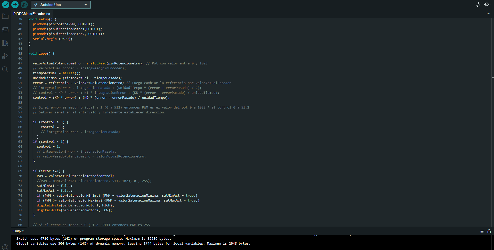

<br />
<div align="center">
	<h3 align="center">Arduino</h3>
	<p align="center">
    	Arduino scripts used mainly to prototype with the Arduino UNO board.
  	</p>
</div>

## Installation

1. Download the [Arduino IDE](https://www.arduino.cc/en/software) software
3. Clone the Repo
   ```sh
   git clone https://github.com/DarioArzaba/ArduinoScripts.git
   cd ArduinoScripts
   ```
4. Open, edit and run any of the `ino` files provided.

</br>
<div align="center"> <p> Example of PID DC motor control </p> </div>


## License

Distributed under the [MIT License](https://mit-license.org/).

## Contact

Dario Arzaba - dario.arzaba@gmail.com